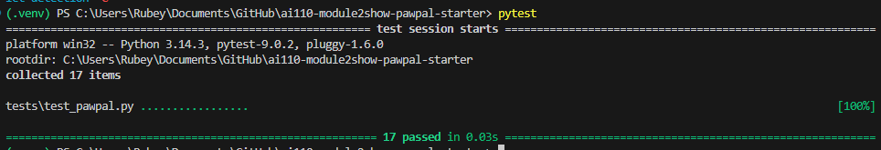

# PawPal+ (Module 2 Project)

This is **PawPal+**, a Streamlit app that helps a pet owner plan care tasks for their pet.

## Smarter Scheduling

- PawPal dynamically generate a schedule for the user, prioritizing urgent task and high priority task.
- User can sort task by due date, priority, and filter out completed tasks.

## Scenario

A busy pet owner needs help staying consistent with pet care. They want an assistant that can:

- Track pet care tasks (walks, feeding, meds, enrichment, grooming, etc.)
- Consider constraints (time available, priority, owner preferences)
- Produce a daily plan and explain why it chose that plan

Your job is to design the system first (UML), then implement the logic in Python, then connect it to the Streamlit UI.

## What you will build

Your final app should:

- Let a user enter basic owner + pet info
- Let a user add/edit tasks (duration + priority at minimum)
- Generate a daily schedule/plan based on constraints and priorities
- Display the plan clearly (and ideally explain the reasoning)
- Include tests for the most important scheduling behaviors

## Getting started

### Setup

```bash
python -m venv .venv
source .venv/bin/activate  # Windows: .venv\Scripts\activate
pip install -r requirements.txt
```

## Testing PawPal+

```python
python -m pytest
```

<details>
<summary>Test Summaries (17 tests)</summary>

1. **`test_mark_complete_changes_status`** — Confirms that calling `mark_complete()` flips `is_complete` from `False` to `True`.
2. **`test_add_task_increases_pet_task_count`** — Verifies that adding a task to a pet increases its task list length by one.
3. **`test_daily_recurring_task_creates_new_task_due_tomorrow`** — Checks that completing a daily task appends a new task to the pet due the following day.
4. **`test_weekly_recurring_task_creates_new_task_due_in_seven_days`** — Checks that completing a weekly task appends a new task due exactly seven days later.
5. **`test_once_task_does_not_create_recurrence`** — Ensures completing a `"once"` task leaves the pet with only that one completed task and no new copy.
6. **`test_recurring_task_without_pet_does_not_raise`** — Confirms that calling `mark_complete()` on an unattached recurring task returns `None` without error.
7. **`test_filter_by_status_returns_only_incomplete`** — Verifies that `filter_by_status(False)` returns only tasks that are not yet complete.
8. **`test_filter_by_status_returns_only_complete`** — Verifies that `filter_by_status(True)` returns only tasks that are marked complete.
9. **`test_scheduler_filter_by_status_across_pets`** — Confirms the Scheduler's `filter_by_status` correctly separates complete and incomplete tasks across multiple pets.
10. **`test_sort_by_priority_overdue_before_due_today_same_priority`** — Verifies that within the same priority tier, an overdue task ranks before a task due today.
11. **`test_sort_by_priority_high_beats_overdue_medium`** — Confirms a HIGH-priority future task ranks above an overdue MEDIUM task.
12. **`test_sort_by_time_orders_tasks_ascending`** — Verifies that `sort_by_time` returns tasks in earliest-to-latest due date order.
13. **`test_sort_by_time_places_no_due_date_at_end`** — Ensures tasks without a due date are placed after tasks that have one.
14. **`test_no_conflicts_in_sequential_plan`** — Confirms that `generate_plan`'s back-to-back slot assignment produces zero conflicts.
15. **`test_conflict_detected_for_overlapping_start_minutes`** — Verifies that two tasks manually given overlapping time slots are flagged as a conflict pair.
16. **`test_no_conflict_for_adjacent_tasks`** — Confirms that tasks whose end and start times merely touch (no overlap) are not reported as conflicts.
17. **`test_conflict_reported_in_plan_reasoning`** — Checks that a sequential plan (no real overlap) produces no spurious `"CONFLICT"` lines in the reasoning output.

</details>
